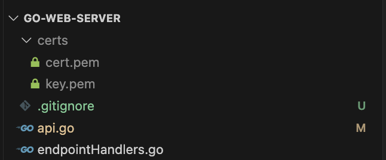

## GO 1.22 server with routing and middleware


TLS is required but you can bypass with environment variable.


## *** To bypass TLS ***

Add NO_TLS=true environment variable. Port is 8080 in this case

Run with 

```
  NO_TLS=true go run *.go
```

then

```
http://localhost:8080/api/v1/user/george/token/1232
```

## *** Self sign certificates tutorial for localhost ***

```
 https://127.0.0.1/api/v1/user/george/token/1232
```

or 

```
https://localhost/api/v1/user/george/token/1232
```

# To set TLS keys for localhost follow this tutorial. https://github.com/FiloSottile/mkcert 

Save the files in a directory named certs on the root.
name the files cert.pem and key.pem



Run with

``` 
go run *.go
```